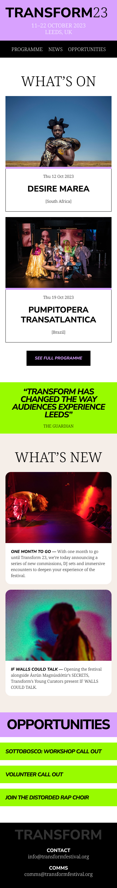

# Examen 1 - Intégration de maquette mobile

## Objectif

Intégrer tous les éléments de la maquette Figma, en étant précis.

## Ressources disponibles

- La documentation du cours et les exercices précédents
- Vos notes personnelles
- La documentation trouvable sur internet

## Ressources exclues

- La communication avec des camarades de classe ou des personnes extérieures
- L’utilisation de smartphones et de logiciels de messagerie (mail, chat, etc.)

Le non-respect de ces exceptions sera sanctionné par la note 1.

## Temps à disposition

Le projet doit être réalisé sur 6 périodes, du mercredi 20.09 au jeudi 21.09.
Le travail se fait uniquement durant les périodes de frontend development, et pas à la maison.

**Un commit doit être réalisé à la fin des 4 premières périodes.**

## Etapes

1. Créez un fork du repository et clonez-le sur votre ordinateur.
2. Dans Figma, allez sur l'équipe _Examen 1_, puis dans le projet _FD-02-Examen-1_. Faites un clic droit sur le fichier _Examen 1_, puis cliquer sur dupliquer. Vous pouvez ensuite accéder au fichier dans votre dossier _Drafts_.
3. Intégrez la maquette, en faisant régulièrement des commits.
4. Une fois l'intégration terminée, publiez votre site sur votre hébergement, dans un sous-dossier _transform_
5. Faites finalement une pull request

## Objectifs avancés

Le artboard de droite nécessite plus de flexbox que celui de gauche. Vous pouvez intégrer l'artboard de droite pour obtenir 4 points supplémentaires.

## Barème

| Critère                                                         | Points |
| --------------------------------------------------------------- | ------ |
| Maîtrise de l'environnement de développement (git, hébergement) | 4      |
| Maquette intégrée dans les temps et avec précision              | 12     |
| Réalisation des objectifs avancés                               | 4      |
| **Total**                                                       | **20** |

